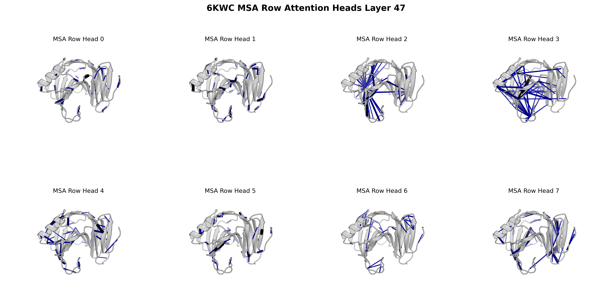

# OpenFold-based Attention Visualization Demo

This is a lightweight extension of [OpenFold](https://github.com/aqlaboratory/openfold) that enables interactive visualization of attention mechanisms in protein structure prediction. It provides tools to render MSA row and Triangle attention scores as:

- Arc diagrams (sequence space)
- 3D PyMOL overlays (structure space)

---

## Key Features

- Compatible with OpenFold outputs (`.pdb`, attention text dumps)
- Support for layer- and head-specific visualizations
- Integrated residue highlighting
- Notebook-friendly and HPC-friendly workflow

---

## Installation

This repo assumes you have already installed [OpenFold and its dependencies](https://openfold.readthedocs.io/en/latest/Installation.html), or you are using CyberShuttle (see `cybershuttle.yml`)
You will also need:
- `PyMOL` (open-source version is sufficient)
- `matplotlib`, `numpy`, `scipy`, `pandas`
- `biopython` (for sequence parsing)

You can also install the full set of dendencies (including those for OpenFold) from our `cybershuttle.yml` file directly.
Beyond confirming the proper installation of OpenFold, you can test the specific dependendices for our repo by using:
```
import os
import numpy as np
import matplotlib.pyplot as plt
import csv
from pymol import cmd
from pymol.cgo import CYLINDER, SPHERE
```

---

## Interactive Demo: `viz_attention_demo.ipynb`

The notebook `viz_attention_demo.ipynb` demonstrates the full visualization pipeline using OpenFold.

It performs the following steps:

1. **Runs inference** using OpenFold with precomputed alignments
2. **Extracts top-k residue–residue attention scores** from each layer and head
3. **Saves these scores** to text files
4. **Visualizes attention**:
   - As **arc diagrams** (residue–residue attention on the sequence)
   - As **3D PyMOL overlays** (on the predicted structure)

We focus on two attention types:
- **MSA Row Attention**
- **Triangle Start Attention**

> The **thickness of the lines** (in both arc diagrams and 3D renderings) indicates the **strength of the attention score**.

---

### MSA Row Attention (Layer 47, Protein 6KWC)

- Shows pairwise attention between residues as inferred from multiple sequence alignments
- Visualized across all attention heads at a selected model layer

Arc diagram (Head 2):


All heads subplot:



---

### Triangle Start Attention (Layer 47, Residue 18)

- Focuses on attention **from a single residue to others**, as part of triangle-based geometric reasoning
- The **selected residue is highlighted**:
  - In arc diagrams: using a **blue label**
  - In 3D visualizations: using a **sphere**

Arc diagram (Head 0):


All heads subplot:


## Acknowledgements

This project is based on [**OpenFold**](https://github.com/aqlaboratory/openfold), an open-source reimplementation of AlphaFold, distributed under the [Apache License 2.0](https://www.apache.org/licenses/LICENSE-2.0).

We have extended OpenFold with:
- Custom visualization tools for attention maps (3D + arc diagrams)
- Demo scripts and configuration for interactive analysis
- Modifications to the inference pipeline for simplified usage

This repository includes source code originally developed by the OpenFold contributors. All original rights and attributions are retained in accordance with the Apache 2.0 License.

---

## License

This project is licensed under the [Apache License 2.0](https://www.apache.org/licenses/LICENSE-2.0).  
See the [LICENSE](./LICENSE) file for details.

---
